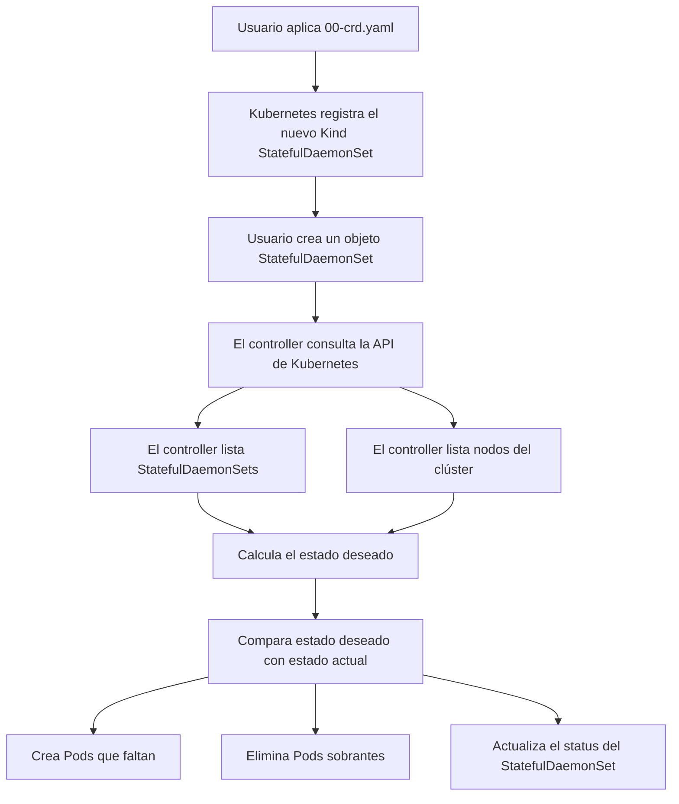

# Laboratorio guiado: crear un recurso `StatefulDaemonSet` con CRD y controller

## 1. Objetivo del laboratorio

El objetivo de este laboratorio es comprender cómo se puede extender Kubernetes creando un recurso propio mediante un **Custom Resource Definition** o **CRD**, y cómo un **controller** puede implementar la lógica necesaria para que ese nuevo recurso tenga comportamiento real dentro del clúster.

Kubernetes incluye muchos objetos nativos, como `Pod`, `Deployment`, `DaemonSet`, `StatefulSet`, `Service`, `ConfigMap`, `Secret`, `Namespace`, etc. Sin embargo, Kubernetes también permite registrar nuevos tipos de objetos en su API. Estos objetos personalizados se llaman **Custom Resources**.

En este laboratorio se creará un recurso personalizado llamado `StatefulDaemonSet`.

La idea didáctica del recurso es combinar dos conceptos conocidos:

```text
DaemonSet      -> un Pod por cada nodo elegible
StatefulSet    -> identidad estable para los Pods
```

El recurso `StatefulDaemonSet` de este laboratorio implementa una idea sencilla:

```text
Crear un Pod por cada nodo elegible, usando un nombre estable basado en el nombre del nodo.
```

Por ejemplo, si existe un objeto `StatefulDaemonSet` llamado `node-agent` y el clúster tiene dos nodos worker llamados `kubernetes-worker1` y `kubernetes-worker2`, el controller intentará mantener estos Pods:

```text
node-agent-kubernetes-worker1
node-agent-kubernetes-worker2
```

Esto permite explicar de forma práctica varios conceptos fundamentales de Kubernetes:

- Qué es un CRD.
- Qué es un recurso personalizado.
- Qué diferencia hay entre definir un recurso y darle comportamiento.
- Qué hace un controller.
- Qué es el patrón de reconciliación.
- Por qué son necesarios los permisos RBAC.
- Para qué se usa el campo `status`.
- Cómo Kubernetes permite extender su API sin modificar el código fuente de Kubernetes.

> Este laboratorio es didáctico. No implementa un controller de producción.

---

## 2. Escenario del laboratorio

El laboratorio asume un clúster Kubernetes con tres nodos:

```text
1 nodo control-plane
2 nodos worker
```

Ejemplo:

```text
kubernetes-master      control-plane
kubernetes-worker1     worker
kubernetes-worker2     worker
```

El recurso de ejemplo se configura con:

```yaml
includeControlPlane: false
```

Por tanto, el controller ignorará el nodo de control-plane y solo creará Pods en los nodos worker.

El resultado esperado será:

```text
1 Pod en kubernetes-worker1
1 Pod en kubernetes-worker2
```

---

## 3. Recursos que se crean en el laboratorio

El laboratorio utiliza los siguientes manifiestos:

| Archivo | Objeto principal | Finalidad |
|---|---|---|
| `00-crd.yaml` | `CustomResourceDefinition` | Registra el nuevo tipo `StatefulDaemonSet` en la API de Kubernetes. |
| `01-namespace-controller.yaml` | `Namespace` | Crea el namespace `sds-lab-system`, donde se ejecutará el controller. |
| `02-rbac.yaml` | `ServiceAccount`, `ClusterRole`, `ClusterRoleBinding` | Concede al controller los permisos necesarios para leer nodos, leer recursos personalizados y gestionar Pods. |
| `03-controller-configmap.yaml` | `ConfigMap` | Guarda el código Python del controller. |
| `04-controller-deployment.yaml` | `Deployment` | Ejecuta el controller como un Pod dentro del clúster. |
| `05-namespace-demo.yaml` | `Namespace` | Crea el namespace `sds-lab`, donde se desplegará el recurso de ejemplo. |
| `06-statefuldaemonset-demo.yaml` | `StatefulDaemonSet` | Crea una instancia del recurso personalizado. |
| `99-cleanup.yaml` | Archivo informativo | Recuerda que la limpieza se realiza mediante los comandos indicados al final del README. |

---

## 4. Arquitectura lógica

El flujo del laboratorio es el siguiente:



La idea principal es:

```text
El usuario declara lo que quiere en spec.
El controller observa el clúster y actúa para acercar el estado real al estado deseado.
El controller informa del resultado en status.
```

---

## 5. Conceptos clave antes de empezar

### 5.1. ¿Qué es un CRD?

Un **CRD**, o **Custom Resource Definition**, es un objeto de Kubernetes que permite registrar un nuevo tipo de recurso en la API del clúster.

Cuando se aplica este manifiesto:

```yaml
apiVersion: apiextensions.k8s.io/v1
kind: CustomResourceDefinition
metadata:
  name: statefuldaemonsets.lab.formacion.cloud
```

Kubernetes aprende que, a partir de ese momento, puede aceptar objetos como este:

```yaml
apiVersion: lab.formacion.cloud/v1alpha1
kind: StatefulDaemonSet
metadata:
  name: node-agent
  namespace: sds-lab
spec:
  includeControlPlane: false
  image: busybox:1.36
```

El CRD define principalmente:

- El grupo de API: `lab.formacion.cloud`.
- La versión: `v1alpha1`.
- El tipo de recurso: `StatefulDaemonSet`.
- El plural: `statefuldaemonsets`.
- El alias corto: `sdslab`.
- Si el recurso es namespaced o cluster-wide.
- Qué campos se aceptan en `spec` y `status`.
- Qué columnas adicionales se mostrarán con `kubectl get`.

En este laboratorio, el CRD es namespaced:

```yaml
scope: Namespaced
```

Esto significa que los objetos `StatefulDaemonSet` se crean dentro de un namespace, igual que ocurre con objetos como `Pod`, `Deployment` o `Service`.

---

### 5.2. Importante: el CRD solo define el tipo de objeto

Crear un CRD no crea Pods, no despliega aplicaciones y no ejecuta lógica por sí mismo.

El CRD solo amplía la API de Kubernetes para que el clúster acepte un nuevo tipo de objeto.

Dicho de otra forma:

```text
CRD = definición del nuevo tipo de recurso
Controller = componente que implementa el comportamiento de ese recurso
```

Sin controller, podríamos crear objetos `StatefulDaemonSet`, verlos con `kubectl get`, editarlos y borrarlos, pero no ocurriría nada más.

Por eso el laboratorio necesita dos piezas:

1. Un CRD que registra el tipo `StatefulDaemonSet`.
2. Un controller que observa esos objetos y crea o elimina Pods según sea necesario.

---

### 5.3. ¿Qué es un controller?

Un **controller** es un proceso que observa el estado del clúster y realiza acciones para que el estado real se parezca al estado deseado.

Este patrón se llama **reconciliación**.

En Kubernetes, muchos objetos nativos funcionan así:

- Un `Deployment` no crea Pods directamente por arte de magia. Hay un controller que observa Deployments y crea ReplicaSets.
- Un `ReplicaSet` no mantiene réplicas por sí mismo. Hay un controller que observa ReplicaSets y crea o elimina Pods.
- Un `DaemonSet` tiene un controller que garantiza que haya Pods en los nodos correspondientes.
- Un `StatefulSet` tiene un controller que mantiene identidades estables y ordenadas.

En este laboratorio, nuestro controller hace algo parecido, pero con un recurso creado por nosotros.

El controller realiza continuamente este ciclo:

```text
1. Listar namespaces activos.
2. Buscar objetos StatefulDaemonSet en esos namespaces.
3. Leer el spec de cada StatefulDaemonSet.
4. Listar los nodos del clúster.
5. Calcular qué nodos son elegibles.
6. Calcular qué Pods deberían existir.
7. Consultar qué Pods existen actualmente.
8. Crear Pods que falten.
9. Eliminar Pods que sobren.
10. Actualizar el status del recurso personalizado.
11. Esperar unos segundos y repetir.
```

En este laboratorio, el controller ejecuta ese ciclo cada 10 segundos.

---

### 5.4. `spec` frente a `status`

En Kubernetes es muy importante distinguir entre `spec` y `status`.

El campo `spec` representa el estado deseado. Es lo que el usuario pide.

Ejemplo:

```yaml
spec:
  includeControlPlane: false
  image: busybox:1.36
  imagePullPolicy: IfNotPresent
  mountPath: /data
```

El campo `status` representa el estado observado. Normalmente lo actualiza el controller.

Ejemplo:

```yaml
status:
  desired: 2
  current: 2
  nodes: kubernetes-worker1,kubernetes-worker2
```

La idea es:

```text
spec   -> lo que quiero
status -> lo que está ocurriendo realmente
```

El usuario modifica el `spec`. El controller actualiza el `status`.

---

### 5.5. ¿Por qué se usa RBAC?

El controller se ejecuta dentro del clúster como un Pod. Para poder consultar y modificar recursos mediante la API de Kubernetes necesita permisos.

Kubernetes no concede permisos automáticamente a los Pods. Por eso se crea una `ServiceAccount` y se asocia a un `ClusterRole` mediante un `ClusterRoleBinding`.

En este laboratorio, el controller necesita permisos para:

- Listar namespaces.
- Listar nodos.
- Leer objetos `StatefulDaemonSet`.
- Actualizar el `status` de los `StatefulDaemonSet`.
- Listar Pods.
- Crear Pods.
- Eliminar Pods.
- Parchear Pods si fuera necesario.

Si el RBAC no estuviera correctamente configurado, el controller arrancaría, pero fallaría al intentar consultar o modificar recursos.

---

## 6. Instalación paso a paso

### Paso 0. Comprobar el acceso al clúster

Antes de empezar, comprueba que puedes acceder al clúster:

```bash
kubectl get nodes
```

Resultado esperado aproximado:

```text
NAME                  STATUS   ROLES           AGE   VERSION
kubernetes-master     Ready    control-plane   ...   ...
kubernetes-worker1    Ready    <none>          ...   ...
kubernetes-worker2    Ready    <none>          ...   ...
```

---

### Paso 1. Crear el CRD

Aplica el CRD:

```bash
kubectl apply -f 00-crd.yaml
```

Espera a que Kubernetes registre correctamente el nuevo recurso:

```bash
kubectl wait --for=condition=Established crd/statefuldaemonsets.lab.formacion.cloud --timeout=60s
```

Comprueba que el CRD existe:

```bash
kubectl get crd statefuldaemonsets.lab.formacion.cloud
```

A partir de este momento, Kubernetes acepta objetos con esta forma:

```yaml
apiVersion: lab.formacion.cloud/v1alpha1
kind: StatefulDaemonSet
```

También se puede usar el alias corto definido en el CRD:

```bash
kubectl get sdslab --all-namespaces
```

De momento no aparecerá ningún objeto porque todavía no se ha creado ninguna instancia del recurso personalizado.

---

### Paso 2. Crear el namespace del controller

```bash
kubectl apply -f 01-namespace-controller.yaml
```

Comprobación:

```bash
kubectl get ns sds-lab-system
```

Este namespace se utiliza para separar los componentes internos del laboratorio. En él se ejecutará el controller.

Separar el controller en su propio namespace es una buena práctica porque permite distinguir entre:

```text
sds-lab-system -> componentes de control del laboratorio
sds-lab        -> recursos y Pods de demostración
```

---

### Paso 3. Aplicar RBAC

```bash
kubectl apply -f 02-rbac.yaml
```

Este archivo crea tres objetos:

```text
ServiceAccount:     statefuldaemonset-controller
ClusterRole:        sds-lab-controller
ClusterRoleBinding: sds-lab-controller
```

La `ServiceAccount` será usada por el Pod del controller.

El `ClusterRole` define los permisos necesarios.

El `ClusterRoleBinding` une ambos elementos, concediendo esos permisos a la `ServiceAccount`.

Comprobaciones:

```bash
kubectl get serviceaccount statefuldaemonset-controller -n sds-lab-system
kubectl get clusterrole sds-lab-controller
kubectl get clusterrolebinding sds-lab-controller
```

---

### Paso 4. Cargar el código del controller

```bash
kubectl apply -f 03-controller-configmap.yaml
```

Este manifiesto crea un `ConfigMap` llamado `statefuldaemonset-controller-code`.

El `ConfigMap` contiene el archivo `controller.py`, que es el código Python del controller.

Comprobación:

```bash
kubectl get configmap statefuldaemonset-controller-code -n sds-lab-system
```

Puedes inspeccionar el código con:

```bash
kubectl get configmap statefuldaemonset-controller-code -n sds-lab-system -o yaml
```

En un entorno real, normalmente el código del controller estaría empaquetado dentro de una imagen de contenedor propia. En este laboratorio se usa un `ConfigMap` para facilitar la explicación: los alumnos pueden ver el código directamente desde Kubernetes sin construir imágenes.

---

### Paso 5. Desplegar el controller

```bash
kubectl apply -f 04-controller-deployment.yaml
```

El controller se ejecuta mediante un `Deployment` con una réplica:

```yaml
kind: Deployment
metadata:
  name: statefuldaemonset-controller
  namespace: sds-lab-system
spec:
  replicas: 1
```

Se utiliza la imagen:

```yaml
image: python:3.12-slim
```

El código Python se monta desde el `ConfigMap` en `/app` y se ejecuta con:

```yaml
command: ["python", "-u", "/app/controller.py"]
```

Espera a que el Deployment esté disponible:

```bash
kubectl rollout status deployment/statefuldaemonset-controller -n sds-lab-system --timeout=120s
```

Comprueba el Pod del controller:

```bash
kubectl get pods -n sds-lab-system
```

Resultado esperado:

```text
NAME                                             READY   STATUS    RESTARTS   AGE
statefuldaemonset-controller-xxxxxxxxxx-xxxxx    1/1     Running   0          ...
```

Revisa los logs:

```bash
kubectl logs -n sds-lab-system deploy/statefuldaemonset-controller --tail=20
```

Salida esperada:

```text
sds lab controller started
```

En este momento el controller ya está funcionando, pero todavía no creará Pods porque aún no existe ningún objeto `StatefulDaemonSet`.

---

### Paso 6. Crear el namespace de demostración

```bash
kubectl apply -f 05-namespace-demo.yaml
```

Comprobación:

```bash
kubectl get ns sds-lab
```

Este namespace contendrá el recurso personalizado de ejemplo y los Pods gestionados por el controller.

---

### Paso 7. Crear el recurso `StatefulDaemonSet` de ejemplo

```bash
kubectl apply -f 06-statefuldaemonset-demo.yaml
```

El manifiesto crea este recurso personalizado:

```yaml
apiVersion: lab.formacion.cloud/v1alpha1
kind: StatefulDaemonSet
metadata:
  name: node-agent
  namespace: sds-lab
spec:
  includeControlPlane: false
  image: busybox:1.36
  imagePullPolicy: IfNotPresent
  mountPath: /data
  command:
    - sh
    - -c
    - while true; do echo "node=$NODE_NAME pod=$HOSTNAME data=$(date)" | tee -a /data/log.txt; sleep 30; done
```

Este objeto no crea Pods por sí solo. Lo que ocurre es lo siguiente:

1. Kubernetes acepta el objeto porque el CRD ya está registrado.
2. El controller detecta que existe un `StatefulDaemonSet` llamado `node-agent`.
3. El controller lee su `spec`.
4. El controller lista los nodos del clúster.
5. Como `includeControlPlane` está a `false`, ignora el nodo control-plane.
6. Calcula que debe existir un Pod por cada worker.
7. Crea los Pods que faltan.

---

## 7. Verificación del resultado

### Paso 8. Ver el recurso personalizado

```bash
kubectl get sdslab -n sds-lab
```

Resultado esperado:

```text
NAME         DESIRED   CURRENT   NODES
node-agent   2         2         kubernetes-worker1,kubernetes-worker2
```

Las columnas `DESIRED`, `CURRENT` y `NODES` existen porque se definieron en el CRD mediante `additionalPrinterColumns`.

Significado:

| Columna | Significado |
|---|---|
| `DESIRED` | Número de nodos elegibles según el `spec`. |
| `CURRENT` | Número de Pods gestionados que están en estado `Running`. |
| `NODES` | Lista de nodos donde debería existir un Pod. |

Puedes ver el recurso completo con:

```bash
kubectl get sdslab node-agent -n sds-lab -o yaml
```

Ahí podrás observar tanto el `spec` como el `status`.

---

### Paso 9. Ver los Pods creados

```bash
kubectl get pods -n sds-lab -o wide
```

Resultado esperado:

```text
NAME                            READY   STATUS    NODE
node-agent-kubernetes-worker1   1/1     Running   kubernetes-worker1
node-agent-kubernetes-worker2   1/1     Running   kubernetes-worker2
```

El nombre de cada Pod se construye así:

```text
<nombre-del-StatefulDaemonSet>-<nombre-del-nodo>
```

Por tanto:

```text
node-agent + kubernetes-worker1 = node-agent-kubernetes-worker1
node-agent + kubernetes-worker2 = node-agent-kubernetes-worker2
```

Esto proporciona una identidad estable basada en el nodo.

Si se borra el Pod `node-agent-kubernetes-worker1`, el controller lo recreará con el mismo nombre porque sigue siendo el Pod deseado para ese nodo.

---

### Paso 10. Revisar logs del controller

```bash
kubectl logs -n sds-lab-system deploy/statefuldaemonset-controller --tail=30
```

Salida esperada aproximada:

```text
sds lab controller started
created pod sds-lab/node-agent-kubernetes-worker1 on kubernetes-worker1
created pod sds-lab/node-agent-kubernetes-worker2 on kubernetes-worker2
reconciled sds-lab/node-agent desired=2 current=2
```

Estos logs muestran claramente el patrón de reconciliación:

```text
El controller detectó que faltaban Pods, los creó y actualizó el estado observado.
```

---

### Paso 11. Revisar logs de los Pods gestionados

```bash
kubectl logs -n sds-lab node-agent-kubernetes-worker1
```

Salida esperada:

```text
node=kubernetes-worker1 pod=node-agent-kubernetes-worker1 data=...
```

Y para el segundo worker:

```bash
kubectl logs -n sds-lab node-agent-kubernetes-worker2
```

Cada Pod escribe periódicamente el nodo donde se está ejecutando y el nombre del Pod.

---

## 8. Pruebas didácticas

### Prueba 1. Autorreparación

Borra manualmente uno de los Pods:

```bash
kubectl delete pod node-agent-kubernetes-worker1 -n sds-lab
```

Espera unos segundos y consulta de nuevo:

```bash
kubectl get pods -n sds-lab -o wide
```

El controller debería recrear el Pod con el mismo nombre:

```text
node-agent-kubernetes-worker1
```

Esta prueba demuestra que el controller no actúa una sola vez. Sigue ejecutando un bucle de reconciliación y corrige desviaciones entre el estado deseado y el estado real.

---

### Prueba 2. Filtrar nodos con `nodeSelector`

Etiqueta un nodo worker:

```bash
kubectl label node kubernetes-worker1 sds-demo=true
```

Edita el recurso personalizado:

```bash
kubectl edit sdslab node-agent -n sds-lab
```

Añade dentro de `spec`:

```yaml
nodeSelector:
  sds-demo: "true"
```

El `spec` debería quedar parecido a este:

```yaml
spec:
  includeControlPlane: false
  image: busybox:1.36
  imagePullPolicy: IfNotPresent
  mountPath: /data
  nodeSelector:
    sds-demo: "true"
```

Espera unos segundos y comprueba:

```bash
kubectl get sdslab -n sds-lab
kubectl get pods -n sds-lab -o wide
```

Resultado esperado:

```text
DESIRED = 1
```

El controller debería eliminar el Pod del worker que ya no cumple el selector.

Para volver al estado inicial, puedes quitar el selector editando el recurso o eliminar la etiqueta del nodo:

```bash
kubectl label node kubernetes-worker1 sds-demo-
```

---

### Prueba 3. Incluir el nodo control-plane

Edita el recurso:

```bash
kubectl edit sdslab node-agent -n sds-lab
```

Cambia:

```yaml
includeControlPlane: false
```

por:

```yaml
includeControlPlane: true
```

Espera unos segundos:

```bash
kubectl get sdslab -n sds-lab
kubectl get pods -n sds-lab -o wide
```

En un clúster con un control-plane y dos workers, `DESIRED` debería pasar de 2 a 3.

> Nota importante: si el nodo control-plane tiene taints, el Pod podría no ejecutarse correctamente allí salvo que tenga las tolerations necesarias. Este laboratorio se centra en la lógica del controller, no en la configuración avanzada de scheduling.

---

## 9. Qué hace internamente el controller

El controller incluido en este laboratorio está escrito en Python y usa directamente la API HTTPS de Kubernetes.

No usa librerías avanzadas como `client-go`, informers o watches. Esto es intencionado para que el funcionamiento sea más fácil de entender.

El ciclo principal es:

```python
while True:
    for ns in list_active_namespaces():
        for cr in list_sds(ns):
            reconcile_one(cr)
    time.sleep(10)
```

La función más importante es `reconcile_one(cr)`.

Para cada objeto `StatefulDaemonSet`, el controller:

1. Lee el namespace y el nombre del recurso.
2. Lee el `spec`.
3. Lista los nodos del clúster.
4. Excluye nodos no schedulables.
5. Excluye el control-plane si `includeControlPlane` es `false`.
6. Aplica el `nodeSelector`, si existe.
7. Calcula los nombres de los Pods deseados.
8. Lista los Pods ya existentes gestionados por ese recurso.
9. Crea los Pods que faltan.
10. Elimina los Pods que ya no deberían existir.
11. Cuenta cuántos Pods están en estado `Running`.
12. Actualiza el `status` del recurso personalizado.

---

## 10. Cómo identifica el controller los Pods gestionados

Los Pods creados por el controller incluyen etiquetas como estas:

```yaml
labels:
  app: node-agent
  training.formacion.cloud/managed-by: statefuldaemonset-controller
  training.formacion.cloud/owner: node-agent
  training.formacion.cloud/node: kubernetes-worker1
```

El controller usa principalmente esta etiqueta para localizar los Pods que gestiona:

```text
training.formacion.cloud/owner=<nombre-del-StatefulDaemonSet>
```

También añade un `ownerReference` hacia el recurso `StatefulDaemonSet`:

```yaml
ownerReferences:
  - apiVersion: lab.formacion.cloud/v1alpha1
    kind: StatefulDaemonSet
    name: node-agent
```

Esto permite reflejar la relación lógica entre el recurso personalizado y los Pods creados a partir de él.

---

## 11. Comparación con recursos nativos

### Comparación con `DaemonSet`

Un `DaemonSet` real garantiza que haya un Pod en cada nodo elegible.

Ejemplos típicos de uso:

- Agentes de red, como Calico o Cilium.
- Agentes de logs.
- Agentes de monitorización.
- Componentes que deben ejecutarse en todos los nodos.

Sin embargo, los Pods de un `DaemonSet` suelen tener nombres con sufijos generados:

```text
calico-node-abcde
calico-node-fghij
```

En este laboratorio, los nombres se derivan del nodo:

```text
node-agent-kubernetes-worker1
node-agent-kubernetes-worker2
```

Eso hace más visible la idea de identidad estable asociada al nodo.

---

### Comparación con `StatefulSet`

Un `StatefulSet` real proporciona identidad estable basada en ordinales:

```text
app-0
app-1
app-2
```

También puede asociar volúmenes persistentes estables a cada réplica mediante `volumeClaimTemplates`.

Este laboratorio no implementa esa funcionalidad completa.

Aquí la identidad estable no se basa en ordinales, sino en el nombre del nodo:

```text
<nombre-del-recurso>-<nombre-del-nodo>
```

Además, este laboratorio usa `emptyDir`, por lo que los datos no son persistentes si el Pod se elimina.

---

### Comparación resumida

| Característica | DaemonSet real | StatefulSet real | StatefulDaemonSet del laboratorio |
|---|---:|---:|---:|
| Un Pod por nodo | Sí | No necesariamente | Sí |
| Nombre estable | No orientado al nodo | Sí, basado en ordinales | Sí, basado en el nodo |
| PVC estable por réplica | No directamente | Sí | No |
| Controller nativo de Kubernetes | Sí | Sí | No, controller didáctico propio |
| Uso recomendado en producción | Sí | Sí | No |

---

## 12. Limitaciones del laboratorio

Este controller está diseñado para explicar conceptos, no para producción.

Limitaciones importantes:

1. No usa informers ni watches, sino polling cada 10 segundos.
2. No implementa leader election.
3. No implementa rolling updates.
4. No implementa finalizers.
5. No implementa validación estricta avanzada del `spec`.
6. No implementa PVCs ni almacenamiento persistente real.
7. Usa `emptyDir`, por lo que los datos se pierden si el Pod desaparece.
8. No implementa tolerations configurables.
9. No implementa recursos de CPU o memoria para los Pods gestionados.
10. No implementa métricas.
11. No tiene tests automatizados.
12. No debería usarse en producción.

Para convertir una idea similar en un controller real sería recomendable usar herramientas como:

- Kubebuilder.
- Operator SDK.
- `client-go`.
- Informers y watches.
- Leader election.
- Webhooks de validación y mutación.
- Métricas Prometheus.
- Tests unitarios y de integración.
- Gestión cuidadosa de finalizers y ownership.

---

## 13. Limpieza del laboratorio

Primero borra el recurso personalizado:

```bash
kubectl delete sdslab node-agent -n sds-lab --ignore-not-found
```

Borra los namespaces:

```bash
kubectl delete ns sds-lab --ignore-not-found
kubectl delete ns sds-lab-system --ignore-not-found
```

Borra los recursos cluster-wide:

```bash
kubectl delete crd statefuldaemonsets.lab.formacion.cloud --ignore-not-found
kubectl delete clusterrole sds-lab-controller --ignore-not-found
kubectl delete clusterrolebinding sds-lab-controller --ignore-not-found
```

Comprobación final:

```bash
kubectl get crd statefuldaemonsets.lab.formacion.cloud
kubectl get ns sds-lab sds-lab-system
kubectl get clusterrole sds-lab-controller
kubectl get clusterrolebinding sds-lab-controller
```

Lo esperado es que esos recursos ya no existan y Kubernetes devuelva mensajes `NotFound`.

---

## 14. Preguntas para los alumnos

1. ¿Qué problema resuelve un CRD?
2. ¿Por qué crear un CRD no es suficiente para que ocurra algo en el clúster?
3. ¿Qué hace realmente el controller de este laboratorio?
4. ¿Qué diferencia hay entre `spec` y `status`?
5. ¿Por qué el controller necesita permisos RBAC?
6. ¿Qué permisos mínimos necesita este controller?
7. ¿Qué ocurre si se borra manualmente un Pod gestionado?
8. ¿Qué ocurre si se añade un nuevo worker al clúster?
9. ¿Qué ocurre si se etiqueta solo un nodo y se usa `nodeSelector`?
10. ¿Qué diferencia hay entre este recurso y un `DaemonSet` real?
11. ¿Qué diferencia hay entre este recurso y un `StatefulSet` real?
12. ¿Qué habría que añadir para soportar almacenamiento persistente real?
13. ¿Por qué `emptyDir` no es suficiente si se quiere conservar información?
14. ¿Qué mejoras serían necesarias para un controller de producción?
15. ¿Qué riesgos tendría conceder permisos demasiado amplios al controller?

---

## 15. Resumen final

Este laboratorio muestra una de las ideas más potentes de Kubernetes: su API es extensible.

Con un CRD podemos registrar un nuevo tipo de objeto. Con un controller podemos implementar el comportamiento asociado a ese objeto.

La idea clave es:

```text
CRD = amplía la API de Kubernetes con un nuevo tipo de recurso
Custom Resource = instancia concreta de ese nuevo tipo
Controller = proceso que observa esos recursos y reconcilia el estado real con el estado deseado
```

En este caso, el recurso personalizado `StatefulDaemonSet` permite expresar esta intención:

```text
Quiero un Pod por cada nodo worker, con un nombre estable basado en el nodo.
```

Y el controller se encarga de llevar esa intención a la práctica creando, eliminando y supervisando Pods dentro del clúster.
